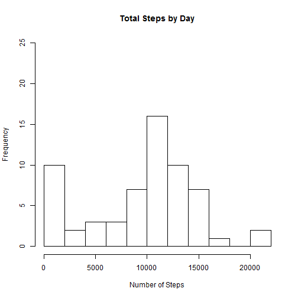
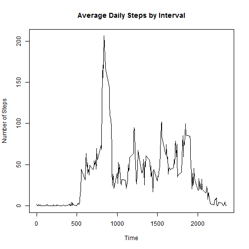
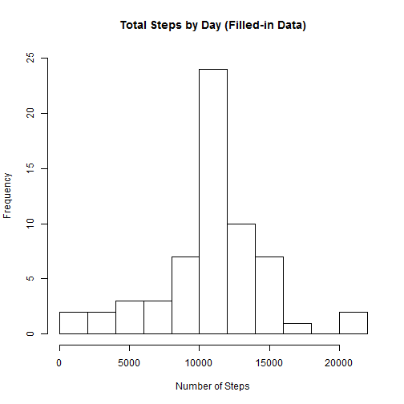

## Reproducible Research: Peer Assessment 1

This document contains code and markdown to perform a well-documented reproducible data analysis on a set of data from a personal activity monitoring device. The readme file contains additional details on this assignment and the data set. The steps in the data analysis, including R code and resulting output and charts, are described below.

The steps are numbered in the order that they appear in the "Overall evaluation/feedback" section of the grading rubric.

#### Step 1: Load the data.
This step assumes that you have downloaded the activity data into your working directory and unzipped it. No preprocessing is required at this point. We read in the data using read.csv() as follows:

```r
data = read.csv('activity.csv')
```

#### Step 2: Make a histogram of the total number of steps taken each day.
For the next several steps, we will ignore any missing values in the dataset. We use the tapply() function to calculate the total number of steps taken each day, then create a histogram to display the result.

```r
totalStepsByDay = tapply(data$steps, data$date, sum, na.rm = T)
hist(totalStepsByDay, ylim = range(0, 25), breaks = 10,
     main = 'Total Steps by Day', xlab = 'Number of Steps')
```

 

#### Step 3: Calculate and report the mean and median total number of steps taken per day.
We use the data frame from above to calculate and output the mean and median steps taken per day.

```r
mean(totalStepsByDay)
```

```
## [1] 9354.23
```

```r
median(totalStepsByDay)
```

```
## [1] 10395
```

#### Step 4: Make a time series plot of the average daily activity pattern.
First we calculate the average number of steps taken per 5-minute interval (averaged across all days) using the tapply() function, then we make a time series plot of the resulting average values.

```r
avgStepsByInterval = tapply(data$steps, data$interval, mean, na.rm = T)
plot(x = names(avgStepsByInterval), y = avgStepsByInterval, type = 'l',
     main = 'Average Daily Steps by Interval',
     xlab = 'Time', ylab = 'Number of Steps')
```

 

#### Step 5: Output the 5-minute interval containing the maximum number of steps.
We now report which 5-minute interval, on average across all the days in the dataset, contains the maximum number of steps.

```r
names(which.max(avgStepsByInterval))
```

```
## [1] "835"
```

#### Step 6: Create a strategy for imputing missing data.
In our dataset there are a number of days/intervals where there are missing values. Since this may introduce bias into calculations or summaries of the data, we will replace missing values for any given interval with that interval's average value across all days.

The code below first makes a copy of the dataset (including missing values) and then calculates the  indices of all missing values. It then associates those indices with the corresponding time interval, which is then used to index into the dataframe that contains average steps by interval. The average value then replaces the missing value in our filled dataframe.

```r
filledData = data
indices = is.na(data$steps)
timelabels = data$interval[indices]
filledData[indices, 'steps'] = avgStepsByInterval[as.character(timelabels)]
```

#### Step 7:  Construct a histogram of steps taken after missing data is imputed.
To visualize the filled-in data we construct a histogram similar to the one from Step 1 above but using the filled-in data instead:

```r
totalStepsByDayFilled = tapply(filledData$steps, filledData$date, sum)
hist(totalStepsByDayFilled, ylim = range(0, 25), breaks = 10,
     main = 'Total Steps by Day (Filled-in Data)', xlab = 'Number of Steps')
```

 

As an additional exercise, we now calculate and report the mean and median total number of steps taken per day using the filled-in dataset.

We note that these values differ from the estimates taken earlier, which ignored missing values. The missing values were being treated as zeros before and have now been replaced with non-zero values, therefore our mean and median have increased.

```r
mean(totalStepsByDayFilled)
```

```
## [1] 10766.19
```

```r
median(totalStepsByDayFilled)
```

```
## [1] 10766.19
```

#### Step 8: Create a panel plot comparing the average number of steps taken on a weekday versus a weekend.
To determine if there are differences in activity patterns between weekdays and weekends, we wish to construct a time series plot comparing them. We first create a new factor variable in the dataset with two levels, "weekday" and "weekend". Then we use tapply() to calculate the average number of steps per interval on each type of day.

```r
filledData$daytype = factor('weekday', levels = c('weekday', 'weekend'))
isWeekend = weekdays(as.Date(filledData$date)) %in% c('Saturday', 'Sunday')
filledData[isWeekend, 'daytype'] = as.factor('weekend')
avgStepsByDaytype = tapply(filledData$steps,
                           list(filledData$interval, filledData$daytype), mean)
```

We create a new data frame to hold the results for each type of day and then combine them into one summary data frame.

```r
dfWeekday = data.frame(interval = as.numeric(rownames(avgStepsByDaytype)),
                       steps = avgStepsByDaytype[, 'weekday'],
                       type = factor('weekday',
                                     levels = c('weekday', 'weekend')))
dfWeekend = data.frame(interval = as.numeric(rownames(avgStepsByDaytype)),
                       steps = avgStepsByDaytype[, 'weekend'],
                       type = factor('weekend',
                                     levels = c('weekday', 'weekend')))
dfCombined = rbind(dfWeekday, dfWeekend)
```

Finally, we use the summary data frame to make a two-part panel plot containing the time series of the average number of steps taken, averaged across all weekday or weekend days.

```r
library(lattice)
xyplot(steps ~ interval | type, dfCombined, layout = c(1, 2), type = 'l')
```

 
